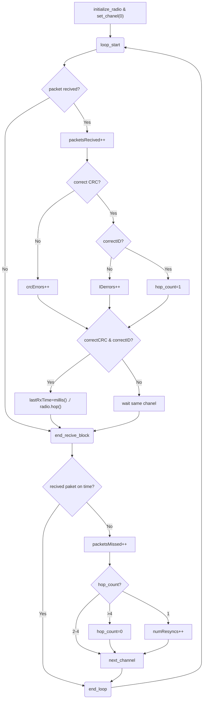

# DIAGRAMA DE FLUJO  

```mermaid  
graph TD;  
    1["initialize_radio & set_chanel(0)"]-->2("loop_start");
    2("loop_start")-->3{"packet recived?"};
    3{"packet recived?"}-- Yes -->4["packetsRecived++"];
    3{"packet recived?"}-- No -->13("end_recive_block");
    4["packetsRecived++"]-->5{"correct CRC?"};
    5{"correct CRC?"}-- Yes -->6{"correctID?"};
    5{"correct CRC?"}-- No -->7["crcErrors++"];
    6{"correctID?"}-- Yes -->9["hop_count=1"];
    6{"correctID?"}-- No -->8["IDerrors++"];
    7["crcErrors++"]-->10{"correctCRC & correctID?"};
    8["IDerrors++"]-->10{"correctCRC & correctID?"};
    9["hop_count=1"]-->10{"correctCRC & correctID?"};
    10{"correctCRC & correctID?"}-- Yes -->11["lastRxTime=millis() ./ radio.hop()"];
    10{"correctCRC & correctID?"}-- No -->12["wait same chanel"];
    11["lastRxTime=millis() ./ radio.hop()"]-->13("end_recive_block");
    12["wait same chanel"]-->13("end_recive_block");
    13("end_recive_block")-->14["recived paket on time?"];
    14{"recived paket on time?"}-- No -->15["packetsMissed++"];
    14{"recived paket on time?"}-- Yes -->20("end_loop");
    15["packetsMissed++"]-->16{"hop_count?"};
    16{"hop_count?"}-- 2-4 -->19["next_channel"];
    16{"hop_count?"}-- >4 -->17["hop_count=0"];
    16{"hop_count?"}-- 1 -->18["numResyncs++"];
    17["hop_count=0"]-->19["next_channel"];
    18["numResyncs++"]-->19["next_channel"];
    19["next_channel"]-->20("end_loop");
    20("end_loop")-->2("loop_start");
```
  
