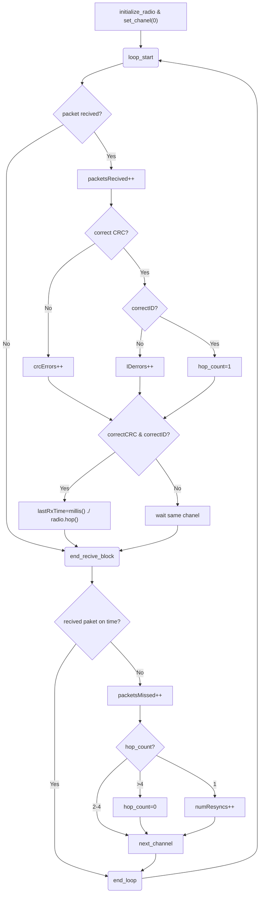

# NodoIoT_RFM69
# TFG: Implementación de nodo IoT para la captura y monitorización de datos de una estación meteorológica Davis
## Equipo:
### Hardware
Sensor Transmitter Davis 6331/2  
Sensor de temperatura y humedad Davis  
Sensor de viento...
Placa Adafruit Adalogger FeatherWing 
Tarjeta microSD de 2Gbytes
PLaca Adafruit Radio FeatherWing  
Placa Adafruit Feather ESP32 V2  
Antena ...  
### Software  
Arduino IDE versión 2.2.1  
Placa Esp32 de espressif version 2.0.4  
## Conexiones pines:

### Placa Adafruit Feather ESP32 V2

SCK -> Pin 5  
MISO -> Pin 21  
MOSI -> Pin 19   
CS RADIO -> Pin 32
CS CD -> Pin 33
IRQ -> Pin 27  
### Adafruit Radio FeatherWing

## Desarrollo.
Para el desarroyo de este proyecto se divirá en tres partes que de forma independiente se podrá testear las diferentes fases del proyecto: Recibir, Guardar y Enviar.  
Estas tres fases serán las implementadas en un archivo .ino que posteriormente serán junatadas en un archivo   *.ino* llamado DEFINITIVO.ino .  
### Recibir.
Esta fase tiene como objetivo recibir paquetes de las distintas estaciones con los datos obtenidos en sus sensores. En nuestro caso tenemos sensores de temperatura, humedad, dirección del viento e intensidad.

El Sensor Transmitter Davis tiene en su interior 4 switches que dependiendo si estan en **ON** u **OFF** representan un canal u otro. Vease la siguiente tabla con información mas detallada
  
Dependiendo del canal escogido transmitirá mas o menos lento los paquetes segun la siguiente equación:  
**(41 + ID)/16 [segundos]**  

**PROTOCOLO DE COMUNICACION RADIO**
El objetivo final es escuchar cada estación, se utilizará un protocolo de comunicacion vía radio llamado *TDMA* (Acceso Multiple por División de Tiempo), que consiste en escuchar durante un periodo de tiempo cada canal como se muestra en la siguiente imagen, por lo que no divides el ancho de banda de la señal y puedes escuchar todos los canales en un tiempo determinado.
Ventaja:        No pierdes ancho de banda vease FDMA (Acceso Múltiple de División de Frecuencia). 
Desventaja:     En cada periodo de tiempo que escuchas una estación, no puedes escuchar las otras, 
                perdiendo información de los otros canales a los que no escuchas.
*¿Por qué el uso de TDMA frente a FDMA?*
- Es simple, el protocolo de comunicación que utiliza la estación Davis no permite dividir el ancho de banda de la señal, haciendo imposible el uso de FDMA. Ademas que el ancho de banda que se utiliza en EU es limitado.

**RECEPCION CON FHSS**
FHSS (Espectro Ensanchado por Salto de Frecuencia), técnica de transmisión de datos inalámbrica que utiliza un ancho de banda mucho mayor que el necesario para transmitir la información. Lo hace mediante el uso de una banda de frecuencia determinada, la cual es dividida en múltiples subfrecuencias. Estas subfrecuencias son saltadas en un orden preestablecido y sincronizado entre el emisor y el receptor.
*Cuáles son las ventajas?*
se basa en la idea de que un salto rápido y constante entre frecuencias dificulta la interceptación de la señal por parte de terceros. Además, permite una mayor resistencia a interferencias y una transmisión más eficiente de los datos.
Esto funciona en nuestro caso de tal forma que una vez te sincronzas con el emisor (Estacion davis A) tu vas saltando de frecuencia al mismo tiempo recibiendo todos los paquetes. Pero en el momento que a una frecuencia llega un paquete indeseado, supongamos de nuestra estacion B, ....... a explicar

**DIAGRAMA DE FLUJO**

Se hará una escucha de cada canal de Xminutos.
Una vez escuchado un canal se duerme. 
### Guardar.
En esta fase, en la tarjeta microSD se creará un archivo con la fecha actual si no está creado. Y dentro 
los datos obtenidos en la escucha del canal se almacenaran en formato .csv
### Enviar.
